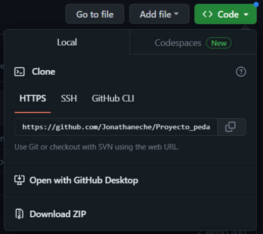

## Montaño Culinary School

This is the backend repository for Montaño Culinary School, a pedagogic project for our studies of full-stack website development at Peñascal Cooperative. The project was developed using Python 3 and MySQL.

To run the backend repository, please make sure you have installed Python on your computer. You can download Python by visiting: https://www.python.org/downloads/.

Then, you can clone the repository or download the zip file.

Once you have the folder with the project, you can open it using Visual Studio Code or the text editor you prefer.

Follow the steps below to run the project:

## 1. Create a virtual environment

Open a terminal or command prompt in the project's root directory. Create a virtual environment using the following command:

python -m venv venv or python3 -m venv .venv

## 2. Activate the virtual environment:

----On macOS and Linux:----

. .venv/bin/activate or source venv/bin/activate

----On Windows:----

.venv\Scripts\activate

## 3. With the virtual environment activated, install the project's dependencies using pip.

pip install -r requirements.txt

## 4. Run the project

python app.py or python3 app.py
